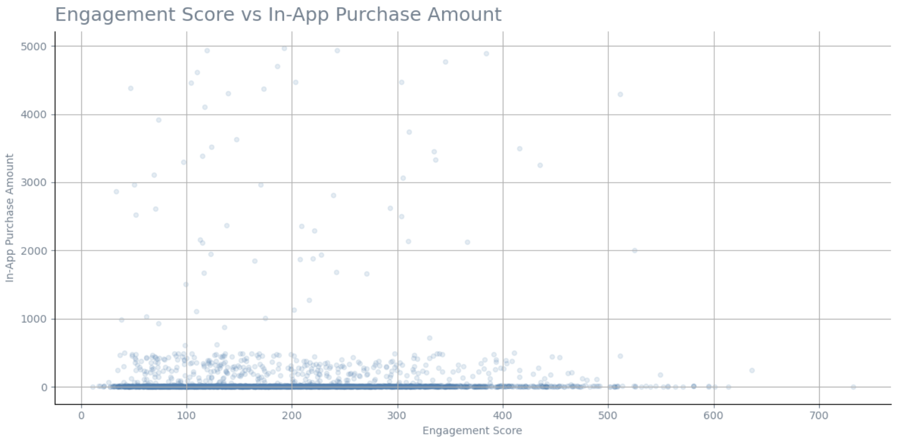

# Mobile Game Player Engagement & Monetization Analysis

## Project Overview

This data analysis project explores player engagement and monetization patterns in a mobile gaming environment using Python, Pandas, Matplotlib, and NumPy.

The analysis assumes the current date is **mid-August 2025**, providing insights based on player activity recorded from the beginning of the year up to that point.

## Business Problem

A mobile game publisher is preparing the launch of several new titles throughout **2026** and wants to better understand player engagement and spending patterns across its existing player base, with a particular focus on differences between game genres. The dataset covers player activity from **January to mid-August 2025**.

The objective of this analysis is to identify engagement and spending patterns across different player segments, generating insights that can support future engagement and in-app purchase strategies.

## Dataset Understanding
[Complete Dataset Documentation written by me](Dataset/Mobile_Game_Dataset_Documentation.txt) 

- **Rows:** 3,024 player records -
- **Columns:** 13 -
- **Granularity:** One record per player
- **Observation Period:** January 2025 – August 2025
- **Data Model:** Single-table analytical dataset

## Dataset Limitations

This dataset has several limitations that should be considered during the analysis:

- One record represents one player.
- Individual gameplay sessions are not available.
- Individual purchase transactions are not available.
- Installation timestamps are not included.
- Purchase-related fields contain missing values because not all players make in-app purchases.
- The dataset does not include information about marketing campaigns, promotional events, pricing strategies, or A/B testing activities.
- The dataset provides a snapshot of player metrics rather than a complete behavioural history, limiting temporal and causal analysis.

## Analytical Approach

The analysis followed a structured data analysis workflow:

**Data Validation & Cleaning → Exploratory Data Analysis → Feature Engineering → Player Segmentation → Data Visualization → Business Insights**

The workflow focused on understanding player engagement and monetization through data cleaning, exploratory analysis, feature engineering, engagement segmentation, and visual storytelling.

## Project Structure

This project is designed to showcase the complete analytical workflow rather than only the final results.

Each notebook represents a different stage of the analysis, from data validation and exploratory analysis to feature engineering, player segmentation, and business insights. For this reason, the notebooks are intended to be reviewed sequentially, as each step builds upon the previous one and reflects the reasoning behind the analytical process.

## Key Findings

- Player spending is left-skewed, with most players making relatively small in-app purchases while a limited number of players spend substantially more.

- High player engagement does not necessarily translate into higher in-app spending, suggesting that monetization is influenced by additional behavioural factors.

- Whale players generate substantially higher revenue despite exhibiting gameplay behaviour similar or lower than Dolphin spending segments.

- Player engagement remains relatively consistent across countries and gamegenres, while average spending differs considerably, indicating potential regional monetization opportunities.

- Several game genres generate above-average in-app purchase revenue despite only average engagement levels, suggesting differences in monetization effectiveness.

## Exploratory Analysis Preview
The following scatterplot summarizes one of the main findings of the analysis, highlighting the relationship between player engagement and in-app purchase amount. Additional visualizations are available in the EDA and Visualization_Complete notebooks.

## Recommendations & Hypotheses

Player engagement across countries and game genres does not fully explain the observed differences in average in-app purchase amounts. Additional data would be required to better understand the factors driving these monetization patterns.

Future analysis should include the payment funnel to identify potential friction points affecting conversion rates. It would also be valuable to determine whether A/B tests or different monetization strategies have been implemented across countries or game genres.

Furthermore, information about marketing campaigns, pricing strategies, promotional offers, and user acquisition efforts by country and game genre would provide additional context and help explain the observed spending differences.

Based on the available dataset, the above key findings should be considered as hypotheses rather than definitive conclusions. Further data would be required to validate these assumptions and develop more robust business recommendations.

## Project Notebooks
The project is organized into three notebooks that document the complete analytical workflow.

# 1) [Data Validation & Cleaning](Data%20Validation%20&%20Cleaning.ipynb) 

# 2) [EDA](EDA.ipynb) 

# 3) [Visualization Complete](Visualization_Complete.ipynb) 

This project was developed as part of my Data Analytics portfolio to demonstrate an end-to-end analytical workflow using Python, Pandas, NumPy and Matplotlib.

--- 

*Alessio Pio Zito*

*Amsterdam, The Netherlands*

*July 2026*
